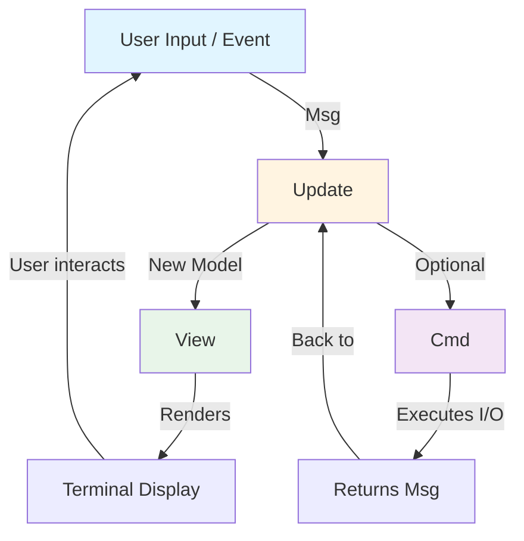

Bubble Tea is built on **The Elm Architecture**, a functional design pattern that provides a clean, predictable way to build interactive applications. This architecture separates concerns beautifully and creates a unidirectional data flow that makes your application easy to reason about.

## Core Principles

The Elm Architecture is based on three core principles:

1. **Single Source of Truth**: All application state lives in one place (the Model)
2. **Unidirectional Data Flow**: Data flows in one direction through the application
3. **Pure Functions**: State changes are predictable and testable

## The Model-Update-View Cycle

Every Bubble Tea application follows this cycle:

<Steps>
  <Step title="Model">
    Your application's state. This is the single source of truth for what your app knows and displays.
  </Step>
  
  <Step title="View">
    A pure function that takes the model and returns what to display. The view never modifies the model.
  </Step>
  
  <Step title="Update">
    Handles messages (events) and returns a new model. This is where state changes happen.
  </Step>
  
  <Step title="Commands">
    Optional I/O operations that return messages. Commands handle side effects like HTTP requests or timers.
  </Step>
</Steps>

## Unidirectional Data Flow

Data flows in one direction through your application:



This unidirectional flow means:
- The View never modifies the Model directly
- The Model never calls the View directly
- All state changes go through Update
- Side effects are isolated in Commands

## Architecture Diagram

Here's how the components work together:

```
┌─────────────────────────────────────────────┐
│                                             │
│  ┌──────────┐      ┌──────────┐            │
│  │   Init   │─────▶│   Cmd    │            │
│  └──────────┘      └──────────┘            │
│       │                  │                  │
│       │                  │                  │
│       ▼                  ▼                  │
│  ┌──────────┐      ┌──────────┐            │
│  │  Model   │      │   Msg    │            │
│  └──────────┘      └──────────┘            │
│       │                  │                  │
│       │                  │                  │
│       ▼                  ▼                  │
│  ┌──────────┐      ┌──────────┐            │
│  │   View   │◀─────│  Update  │────┐       │
│  └──────────┘      └──────────┘    │       │
│       │                             │       │
│       │                        ┌────▼────┐  │
│       ▼                        │   Cmd   │  │
│  ┌──────────┐                 └─────────┘  │
│  │  Render  │                      │        │
│  └──────────┘                      │        │
│                                    │        │
│                              (loops back)   │
│                                             │
└─────────────────────────────────────────────┘
```

## How It Works

### 1. Initialization

When your program starts, Bubble Tea calls `Init()` on your model:

```go
func (m model) Init() tea.Cmd {
    // Return an initial command or nil
    return nil
}
```

See [tea.go:52-55](/workspace/source/tea.go:52)

### 2. The Update Loop

When something happens (a key press, timer tick, HTTP response), Bubble Tea:
1. Wraps it in a `Msg` (message)
2. Passes it to `Update()` along with the current model
3. Gets back a new model and optional command
4. Calls `View()` with the new model
5. Renders the result

```go
func (m model) Update(msg tea.Msg) (tea.Model, tea.Cmd) {
    switch msg := msg.(type) {
    case tea.KeyPressMsg:
        // Handle key presses
        if msg.String() == "q" {
            return m, tea.Quit
        }
    }
    return m, nil
}
```

See [tea.go:57-60](/workspace/source/tea.go:57)

### 3. Rendering

The `View()` method is called after every update:

```go
func (m model) View() tea.View {
    return tea.NewView("Hello, World!")
}
```

See [tea.go:61-64](/workspace/source/tea.go:61)

## Benefits

<CardGroup cols={2}>
  <Card title="Predictable" icon="check-circle">
    Same input always produces same output. No hidden state changes.
  </Card>
  
  <Card title="Testable" icon="flask">
    Pure functions are easy to test. No mocking required for most logic.
  </Card>
  
  <Card title="Debuggable" icon="bug">
    Clear sequence of events. Easy to trace how state changes.
  </Card>
  
  <Card title="Composable" icon="cubes">
    Models, updates, and views can be composed from smaller pieces.
  </Card>
</CardGroup>

## Example: Counter Application

Here's a complete example showing the architecture in action:

```go
package main

import (
    "fmt"
    tea "charm.land/bubbletea/v2"
)

// 1. Model: Application state
type model struct {
    count int
}

// 2. Init: Initial command (none needed here)
func (m model) Init() tea.Cmd {
    return nil
}

// 3. Update: Handle messages and update state
func (m model) Update(msg tea.Msg) (tea.Model, tea.Cmd) {
    switch msg := msg.(type) {
    case tea.KeyPressMsg:
        switch msg.String() {
        case "up":
            m.count++
        case "down":
            m.count--
        case "q", "ctrl+c":
            return m, tea.Quit
        }
    }
    return m, nil
}

// 4. View: Render the UI
func (m model) View() tea.View {
    s := fmt.Sprintf("Count: %d\n\nPress up/down to change, q to quit.", m.count)
    return tea.NewView(s)
}

func main() {
    p := tea.NewProgram(model{count: 0})
    if _, err := p.Run(); err != nil {
        fmt.Printf("Error: %v", err)
    }
}
```

## Why The Elm Architecture?

<AccordionGroup>
  <Accordion title="Eliminates Race Conditions">
    Since all state changes go through Update, you can't have two parts of your code modifying state simultaneously.
  </Accordion>
  
  <Accordion title="Makes Time Travel Debugging Possible">
    Because updates are pure functions, you can replay the exact sequence of messages to reproduce any state.
  </Accordion>
  
  <Accordion title="Simplifies Concurrent Operations">
    Commands handle I/O concurrently, but results come back as messages through the same Update function.
  </Accordion>
  
  <Accordion title="Works Well with Go">
    The pattern maps naturally to Go's strengths: simple types, clear interfaces, and explicit error handling.
  </Accordion>
</AccordionGroup>

## Key Takeaways

<Note>
  The Elm Architecture gives you:
  - **One way** to change state (through Update)
  - **One place** to handle events (the Update function)
  - **One source** of truth (the Model)
  
  This simplicity makes complex applications manageable.
</Note>

## Next Steps

<CardGroup cols={2}>
  <Card title="Model" icon="database" href="/concepts/model">
    Learn about the Model interface and how to structure your application state
  </Card>
  
  <Card title="Messages" icon="envelope" href="/concepts/messages">
    Discover how messages flow through your application
  </Card>
  
  <Card title="Commands" icon="terminal" href="/concepts/commands">
    Understand how to perform I/O operations
  </Card>
  
  <Card title="Views" icon="eye" href="/concepts/views">
    Master rendering your application's UI
  </Card>
</CardGroup>
