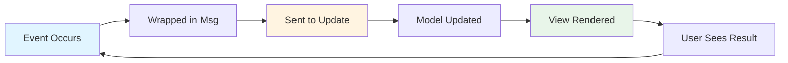

Messages (Msgs) are the events that drive your Bubble Tea application. Every interaction, timer tick, HTTP response, and system event becomes a message that flows through your `Update` method.

## What Are Messages?

From [tea.go:47-49](/workspace/source/tea.go:47):

```go
// Msg contain data from the result of a IO operation. Msgs trigger the update
// function and, henceforth, the UI.
type Msg = uv.Event
```

<Note>
  A `Msg` can be **any type**. This flexibility lets you define custom messages that perfectly match your application's needs.
</Note>

## The Message Flow



1. Something happens (key press, timer, etc.)
2. Bubble Tea wraps it in a `Msg`
3. Your `Update` method receives it
4. You return an updated model
5. Bubble Tea calls `View` and renders

## Built-in Message Types

Bubble Tea provides several built-in message types for common events.

### Keyboard Messages

#### KeyPressMsg

The most common message - sent when a key is pressed.

From [key.go:190-221](/workspace/source/key.go:190):

```go
// KeyPressMsg represents a key press message.
type KeyPressMsg Key

func (k KeyPressMsg) String() string
func (k KeyPressMsg) Keystroke() string
func (k KeyPressMsg) Key() Key
```

**Usage:**

```go
func (m model) Update(msg tea.Msg) (tea.Model, tea.Cmd) {
    switch msg := msg.(type) {
    case tea.KeyPressMsg:
        // Method 1: String matching (simpler)
        switch msg.String() {
        case "ctrl+c", "q":
            return m, tea.Quit
        case "up", "k":
            m.cursor--
        case "enter":
            return m, m.submit()
        }
        
        // Method 2: Key code matching (more precise)
        key := msg.Key()
        switch key.Code {
        case tea.KeyEnter:
            return m, m.submit()
        case tea.KeyUp:
            m.cursor--
        }
    }
    return m, nil
}
```

#### Key Structure

From [key.go:302-343](/workspace/source/key.go:302):

```go
type Key struct {
    // Text contains the actual characters received
    Text string
    
    // Mod represents modifier keys (Ctrl, Alt, Shift, etc.)
    Mod KeyMod
    
    // Code represents the key pressed
    Code rune
    
    // ShiftedCode is the shifted key (e.g., 'A' when shift+a)
    ShiftedCode rune
    
    // BaseCode is the key on a standard PC-101 layout
    BaseCode rune
    
    // IsRepeat indicates if key is being held down
    IsRepeat bool
}
```

**Common Key Codes:**

```go
tea.KeyEnter     // Enter/Return key
tea.KeySpace     // Space bar
tea.KeyBackspace // Backspace
tea.KeyTab       // Tab
tea.KeyEsc       // Escape

// Arrow keys
tea.KeyUp
tea.KeyDown
tea.KeyLeft
tea.KeyRight

// Function keys
tea.KeyF1 through tea.KeyF63

// Special keys
tea.KeyHome
tea.KeyEnd
tea.KeyPgUp
tea.KeyPgDown
tea.KeyDelete
tea.KeyInsert
```

See [key.go:16-188](/workspace/source/key.go:16) for the complete list.

#### KeyReleaseMsg

Sent when a key is released (requires keyboard enhancements).

```go
case tea.KeyReleaseMsg:
    fmt.Println("Key released:", msg.String())
```

### Mouse Messages

From [mouse.go:44-51](/workspace/source/mouse.go:44):

```go
// MouseMsg represents a mouse message. This is a generic mouse message that
// can represent any kind of mouse event.
type MouseMsg interface {
    fmt.Stringer
    Mouse() Mouse
}
```

#### Mouse Structure

```go
type Mouse struct {
    X, Y   int          // Position (0-based from top-left)
    Button MouseButton  // Which button
    Mod    KeyMod       // Modifier keys held
}
```

#### Mouse Button Constants

From [mouse.go:29-42](/workspace/source/mouse.go:29):

```go
tea.MouseNone        // No button
tea.MouseLeft        // Left button
tea.MouseMiddle      // Middle button
tea.MouseRight       // Right button
tea.MouseWheelUp     // Scroll up
tea.MouseWheelDown   // Scroll down
tea.MouseWheelLeft   // Scroll left
tea.MouseWheelRight  // Scroll right
tea.MouseBackward    // Browser back button
tea.MouseForward     // Browser forward button
```

#### Mouse Event Types

<Tabs>
  <Tab title="MouseClickMsg">
    ```go
    case tea.MouseClickMsg:
        m := msg.Mouse()
        if m.Button == tea.MouseLeft {
            fmt.Printf("Clicked at (%d, %d)\n", m.X, m.Y)
        }
    ```
  </Tab>
  
  <Tab title="MouseReleaseMsg">
    ```go
    case tea.MouseReleaseMsg:
        m := msg.Mouse()
        fmt.Printf("Released at (%d, %d)\n", m.X, m.Y)
    ```
  </Tab>
  
  <Tab title="MouseWheelMsg">
    ```go
    case tea.MouseWheelMsg:
        m := msg.Mouse()
        if m.Button == tea.MouseWheelUp {
            m.scrollUp()
        }
    ```
  </Tab>
  
  <Tab title="MouseMotionMsg">
    ```go
    case tea.MouseMotionMsg:
        m := msg.Mouse()
        // Track cursor position
        m.cursorX, m.cursorY = m.X, m.Y
    ```
  </Tab>
</Tabs>

<Warning>
  Mouse events require enabling mouse mode in your view:
  
  ```go
  func (m model) View() tea.View {
      v := tea.NewView(m.render())
      v.MouseMode = tea.MouseModeAllMotion  // Enable all mouse events
      return v
  }
  ```
</Warning>

### Window Messages

#### WindowSizeMsg

Sent when the terminal is resized or when the program starts.

```go
case tea.WindowSizeMsg:
    m.width = msg.Width
    m.height = msg.Height
    // Resize child components
    m.viewport.Width = msg.Width
    m.viewport.Height = msg.Height - 2
```

<Tip>
  You'll receive a `WindowSizeMsg` immediately when your program starts, giving you the initial terminal dimensions.
</Tip>

### System Messages

#### QuitMsg

Signals the program should quit.

From [tea.go:534-541](/workspace/source/tea.go:534):

```go
// QuitMsg signals that the program should quit.
type QuitMsg struct{}

// Quit is a special command that tells the Bubble Tea program to exit.
func Quit() Msg {
    return QuitMsg{}
}
```

**Usage:**

```go
case tea.KeyPressMsg:
    if msg.String() == "q" {
        return m, tea.Quit  // Returns a command that sends QuitMsg
    }

case tea.QuitMsg:
    // Handle cleanup before quitting
    return m, nil
```

#### InterruptMsg

Sent when Ctrl+C is pressed (when not caught as a key press).

From [tea.go:560-572](/workspace/source/tea.go:560):

```go
// InterruptMsg signals the program should interrupt.
type InterruptMsg struct{}

func Interrupt() Msg {
    return InterruptMsg{}
}
```

#### SuspendMsg / ResumeMsg

Sent when the program is suspended (Ctrl+Z) and resumed.

From [tea.go:543-558](/workspace/source/tea.go:543):

```go
// SuspendMsg signals the program should suspend.
type SuspendMsg struct{}

func Suspend() Msg {
    return SuspendMsg{}
}

// ResumeMsg can be listened to do something once a program is resumed back
// from a suspend state.
type ResumeMsg struct{}
```

**Example:**

```go
case tea.SuspendMsg:
    // Save state before suspending
    m.saveState()
    return m, tea.Suspend

case tea.ResumeMsg:
    // Refresh after resuming
    return m, m.fetchLatestData()
```

### Color and Terminal Info

#### ColorProfileMsg

Sent when the terminal's color capabilities are detected.

```go
case tea.ColorProfileMsg:
    m.profile = msg.Profile
    // Adjust colors based on capabilities
```

## Custom Messages

The real power of messages is defining your own types.

### Defining Custom Messages

```go
// Simple message with no data
type tickMsg time.Time

// Message with data
type userLoadedMsg struct {
    user User
}

// Error message
type errMsg struct {
    err error
}
```

<Note>
  By convention, custom message types end with `Msg`, but this isn't required.
</Note>

### Using Custom Messages

```go
func (m model) Update(msg tea.Msg) (tea.Model, tea.Cmd) {
    switch msg := msg.(type) {
    
    case tickMsg:
        m.lastTick = time.Time(msg)
        return m, tick()  // Schedule next tick
    
    case userLoadedMsg:
        m.user = msg.user
        m.loading = false
        return m, nil
    
    case errMsg:
        m.err = msg.err
        m.loading = false
        return m, nil
    }
    return m, nil
}
```

### Creating Custom Messages from Commands

Commands return messages:

```go
func fetchUser(id int) tea.Cmd {
    return func() tea.Msg {
        user, err := api.GetUser(id)
        if err != nil {
            return errMsg{err}
        }
        return userLoadedMsg{user}
    }
}

// Use in Update
case tea.KeyPressMsg:
    if msg.String() == "enter" {
        m.loading = true
        return m, fetchUser(m.selectedID)
    }
```

See [examples/simple/main.go:73-78](/workspace/source/examples/simple/main.go:73) for a real example.

## Message Patterns

### The Tick Pattern

```go
type tickMsg time.Time

func tick() tea.Cmd {
    return tea.Tick(time.Second, func(t time.Time) tea.Msg {
        return tickMsg(t)
    })
}

func (m model) Update(msg tea.Msg) (tea.Model, tea.Cmd) {
    switch msg.(type) {
    case tickMsg:
        m.counter++
        return m, tick()  // Schedule next tick
    }
    return m, nil
}
```

### The Request/Response Pattern

```go
// Request
type loadDataMsg struct{}

// Responses
type dataLoadedMsg struct {
    data []Item
}
type dataErrorMsg struct {
    err error
}

func loadData() tea.Cmd {
    return func() tea.Msg {
        data, err := fetchData()
        if err != nil {
            return dataErrorMsg{err}
        }
        return dataLoadedMsg{data}
    }
}
```

### The State Machine Pattern

```go
type state int

const (
    stateLoading state = iota
    stateReady
    stateError
)

type stateChangeMsg struct {
    newState state
}

func (m model) Update(msg tea.Msg) (tea.Model, tea.Cmd) {
    switch msg := msg.(type) {
    case stateChangeMsg:
        m.state = msg.newState
        switch msg.newState {
        case stateLoading:
            return m, loadData()
        case stateReady:
            return m, nil
        case stateError:
            return m, nil
        }
    }
    return m, nil
}
```

## Best Practices

<AccordionGroup>
  <Accordion title="Use Type Switches">
    Always use type switches to handle messages:
    
    ```go
    // Good
    switch msg := msg.(type) {
    case tea.KeyPressMsg:
        // msg is now KeyPressMsg
    }
    
    // Bad - loses type information
    switch msg.(type) {
    case tea.KeyPressMsg:
        // msg is still tea.Msg
    }
    ```
  </Accordion>
  
  <Accordion title="Handle All Cases">
    Always have a default case that returns the model unchanged:
    
    ```go
    func (m model) Update(msg tea.Msg) (tea.Model, tea.Cmd) {
        switch msg := msg.(type) {
        case myMsg:
            // Handle
        default:
            // Don't drop messages you don't recognize
        }
        return m, nil
    }
    ```
  </Accordion>
  
  <Accordion title="Keep Messages Simple">
    Messages should be plain data - no methods, no behavior:
    
    ```go
    // Good
    type userLoadedMsg struct {
        user User
    }
    
    // Bad - too much behavior
    type userLoadedMsg struct {
        user User
    }
    func (m userLoadedMsg) Process() { /* ... */ }
    ```
  </Accordion>
  
  <Accordion title="Document Custom Messages">
    Add comments explaining when and why messages are sent:
    
    ```go
    // tickMsg is sent every second to update the countdown timer.
    type tickMsg time.Time
    
    // dataLoadedMsg is sent when the API request completes successfully.
    type dataLoadedMsg struct {
        items []Item
    }
    ```
  </Accordion>
</AccordionGroup>

## Next Steps

<CardGroup cols={3}>
  <Card title="Commands" icon="terminal" href="/concepts/commands">
    Learn how to create commands that generate messages
  </Card>
  
  <Card title="Model" icon="database" href="/concepts/model">
    Understand how messages update your model
  </Card>
  
  <Card title="Views" icon="eye" href="/concepts/views">
    See how model updates trigger rendering
  </Card>
</CardGroup>
